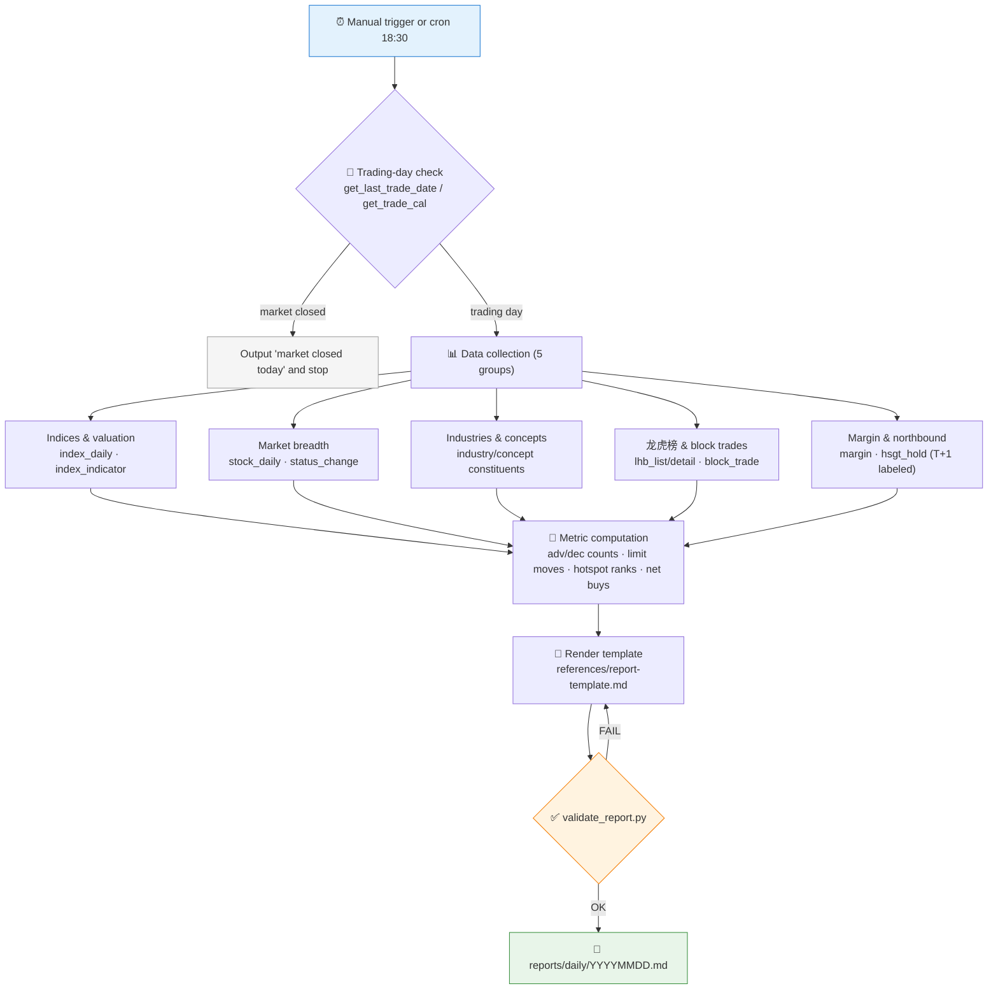

# 📰 Market Daily Review Skill

[简体中文](README.md) | **English**

> One sentence after the close generates a full A-share daily review: indices & valuation, market breadth, industry/concept hotspots, 龙虎榜 (Dragon-Tiger list), block trades, margin financing, northbound holdings — every number traceable, scheduled automation supported.

<p align="center">
  
  
  
  
  
  
</p>

---

## 📖 What is this

`market-daily-review` is an **Agent Skill** that generates A-share end-of-day review reports from Pandadata. It ships with a fixed report template, a unified data-collection order, explicit T+1 data labeling rules, and an **automatic validator** — after the report is written, `scripts/validate_report.py` checks section completeness, data-source annotations, and the disclaimer; failures are fixed before delivery.

It can be triggered manually ("今天复盘一下") or wired as an after-close scheduled task that writes `reports/daily/YYYYMMDD.md` at 18:30 on every trading day.

> All data contracts come from the sibling skill [`pandadata-api`](https://github.com/quantskills/skill-pandadata-api).

---

## ⚡ Generation Pipeline



---

## 🗂️ Report Sections × Interface Map

| Section | Interfaces | Metrics produced |
|---|---|---|
| 1️⃣ Index overview & valuation | `get_index_daily` · `get_index_indicator` | Change %, turnover, PE/PB, valuation percentile |
| 2️⃣ Market breadth & sentiment | `get_stock_daily` / `get_stock_rt_daily` · `get_stock_status_change` | Advancers/decliners, limit-up/down counts (convention stated), turnover leaders, new ST / cap removals |
| 3️⃣ Industry & concept hotspots | `get_industry_constituents` · `get_concept_list` · `get_concept_constituents` | Industry/concept gainers with representative stocks |
| 4️⃣ 龙虎榜 & block trades | `get_lhb_list` · `get_lhb_detail` · `get_block_trade` | Listing reasons, seat net buys, block premium/discount distribution |
| 5️⃣ Margin & northbound | `get_margin` · `get_hsgt_hold` | Margin balance changes, top northbound adds/cuts (**T+1 data date always labeled**) |
| 6️⃣ Anomalies & risk notes | aggregate of the above | ST changes, unusual turnover, consecutive moves |
| 7️⃣ Data notes | — | Interfaces used, data cutoff, missing/degraded items, statistical conventions |

---

## 🚀 Quick Start

### 1️⃣ Install (together with pandadata-api)

```bash
# Claude Code (global)
cp -r skill-pandadata-api       ~/.claude/skills/pandadata-api
cp -r skill-market-daily-review ~/.claude/skills/market-daily-review
```

### 2️⃣ Manual trigger

```text
今天复盘一下
生成 20260610 的收盘总结
看看今天龙虎榜和北向资金动向
```

### 3️⃣ Scheduled daily review

One sentence to the Agent is enough:

```text
帮我设置每个交易日 18:30 自动生成当日复盘
```

The task is **idempotent**: if a report already exists for the day it is regenerated and overwritten; on non-trading days it only outputs "market closed today". 18:30 is chosen so delayed disclosures (margin, northbound) have landed.

### 4️⃣ Validate a report

```bash
python scripts/validate_report.py reports/daily/20260611.md
# OK            -> passed
# FAIL + list   -> missing sections/annotations listed; fix before delivery
```

Checks include: 9 required sections, data-source notes, data date/cutoff, T+1 labels for margin & northbound, and the not-investment-advice disclaimer.

---

## 📦 Directory Layout

```
market-daily-review/
├── SKILL.md                          # Skill entry: workflow, report rules, automation conventions
├── references/
│   ├── pandadata-map.md              # 🧭 Section-to-interface routing table + degradation strategy
│   └── report-template.md            # 📄 Review report Markdown template (with convention placeholders)
├── scripts/
│   └── validate_report.py            # ✅ Report completeness validator
└── agents/
    └── openai.yaml                   # OpenAI/Codex adapter
```

---

## 📐 Core Constraints

| Constraint | Description |
|---|---|
| 📅 Absolute dates | Report bodies use absolute dates like `2026-06-11`, never a vague "today" |
| 🕐 T+1 always labeled | Delayed disclosures (margin, northbound) must carry their actual data date |
| 📏 Conventions stated | Whether limit-move counts include ST or one-tick boards must be written out |
| 🛟 Graceful degradation | If market-wide/concept aggregation fails, keep usable sections (indices, 龙虎榜); record gaps in "Data notes" — **never estimate numbers** |
| 🚫 Describe, don't recommend | Factual summarization and structure only; no next-day trading advice |

---

## ⚠️ Disclaimer

Reports are factual market summaries for research reference only. Nothing here constitutes investment advice.

## 📜 License

This project is licensed under the GNU General Public License v3.0. See [LICENSE](LICENSE).

## 🐼 PandaAI / QUANTSKILLS Community

<div align="center">
  
  <br>
  <sub>Scan the QR code to join the PandaAI community for QUANTSKILLS skills, agent workflows, and quantitative research practice.</sub>
</div>
