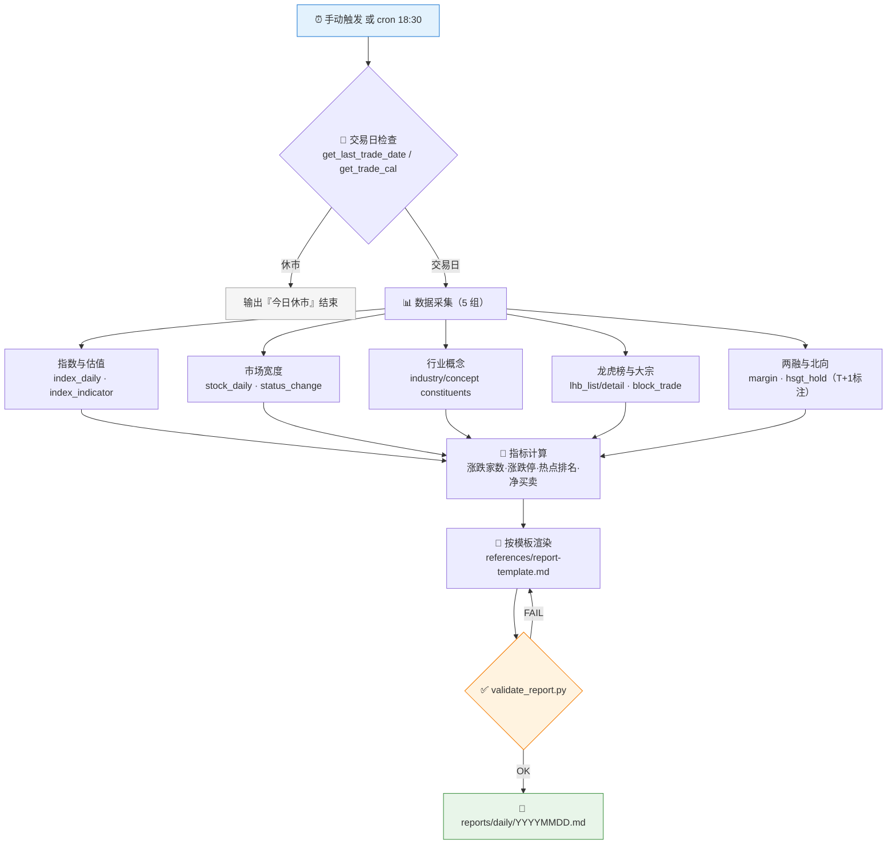

# 📰 Market Daily Review Skill

**简体中文** | [English](README.en.md)

> 收盘后一句话生成 A 股当日复盘：指数与估值、市场宽度、行业概念热点、龙虎榜、大宗、两融、北向 —— 每个数字可溯源，支持定时自动生成。

<p align="center">
  
  
  
  
  
  
</p>

---

## 📖 这是什么

`market-daily-review` 是一个 **Agent Skill**：基于 Pandadata 数据生成 A 股收盘复盘报告。它内置了固定的报告模板、统一的数据采集顺序、明确的 T+1 数据标注规则，以及一个**自动校验脚本** —— 报告写完后用 `scripts/validate_report.py` 检查章节完整性、数据来源标注和免责声明，不合格就修，合格才交付。

可以手动触发（"今天复盘一下"），也可以挂成交易日收盘后的定时任务，每天 18:30 自动产出 `reports/daily/YYYYMMDD.md`。

> 数据契约一律来自姊妹技能 [`pandadata-api`](https://github.com/quantskills/skill-pandadata-api)。

---

## ⚡ 生成流水线



---

## 🗂️ 报告章节 × 接口映射

| 章节 | 接口 | 产出指标 |
|---|---|---|
| 1️⃣ 指数概览与估值 | `get_index_daily` · `get_index_indicator` | 涨跌幅、成交额、PE/PB、估值分位 |
| 2️⃣ 市场宽度与情绪 | `get_stock_daily` / `get_stock_rt_daily` · `get_stock_status_change` | 涨跌家数、涨跌停数（口径声明）、成交额龙头、新增 ST/摘帽 |
| 3️⃣ 行业与概念热点 | `get_industry_constituents` · `get_concept_list` · `get_concept_constituents` | 行业/概念涨幅榜 + 代表个股 |
| 4️⃣ 龙虎榜与大宗 | `get_lhb_list` · `get_lhb_detail` · `get_block_trade` | 上榜原因、席位净买卖、大宗折溢价分布 |
| 5️⃣ 两融与北向 | `get_margin` · `get_hsgt_hold` | 两融余额变化、北向加减仓前列（**T+1 数据日必标**） |
| 6️⃣ 异动与风险提示 | 汇总以上 | ST 变更、异常成交、连续涨跌 |
| 7️⃣ 数据说明 | — | 使用接口、数据截止、缺失/降级说明、统计口径 |

---

## 🚀 快速开始

### 1️⃣ 安装（与 pandadata-api 一起）

```bash
# Claude Code（全局）
cp -r skill-pandadata-api       ~/.claude/skills/pandadata-api
cp -r skill-market-daily-review ~/.claude/skills/market-daily-review
```

### 2️⃣ 手动触发

```text
今天复盘一下
生成 20260610 的收盘总结
看看今天龙虎榜和北向资金动向
```

### 3️⃣ 定时自动复盘

向 Agent 说一句即可：

```text
帮我设置每个交易日 18:30 自动生成当日复盘
```

任务设计为**幂等**：当日报告已存在时重新生成并覆盖；非交易日只输出"今日休市"。选 18:30 之后是为了等两融、北向等延迟披露的数据落库。

### 4️⃣ 校验报告

```bash
python scripts/validate_report.py reports/daily/20260611.md
# OK            -> 通过
# FAIL + 清单    -> 列出缺失章节/缺失标注，修完再交
```

校验项包括：9 个必备章节、数据来源说明、数据日/截止时间、两融北向的 T+1 标注、非投资建议声明。

---

## 📦 目录结构

```
market-daily-review/
├── SKILL.md                          # 技能入口：工作流、报告规则、自动化约定
├── references/
│   ├── pandadata-map.md              # 🧭 章节到接口的路由表 + 降级策略
│   └── report-template.md            # 📄 复盘报告 Markdown 模板（含口径占位）
├── scripts/
│   └── validate_report.py            # ✅ 报告完整性校验器
└── agents/
    └── openai.yaml                   # OpenAI/Codex 适配
```

---

## 📐 核心约束

| 约束 | 说明 |
|---|---|
| 📅 绝对日期 | 报告正文用 `2026-06-11` 这类绝对日期，不用含糊的"今天" |
| 🕐 T+1 必标 | 两融、北向等延迟披露数据必须标注实际数据日 |
| 📏 口径声明 | 涨跌停统计是否含 ST、是否含一字板，必须写明 |
| 🛟 优雅降级 | 全市场/概念聚合失败时保留指数、龙虎榜等可用章节，缺失项写入"数据说明"，**不估数** |
| 🚫 只述不荐 | 只做事实归纳与结构梳理，不给明日操作建议 |

---

## ⚠️ 免责声明

本报告仅作市场事实归纳与结构梳理，仅供研究参考，不构成任何投资建议。

## 📜 License

This project is licensed under the GNU General Public License v3.0. See [LICENSE](LICENSE).
